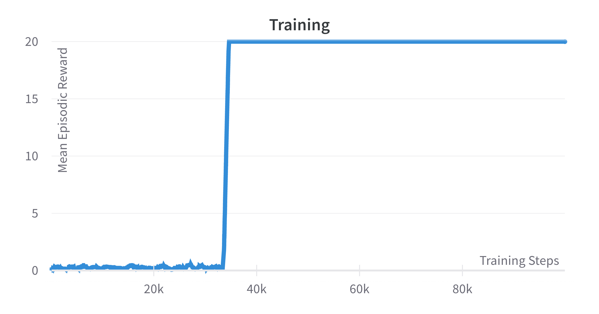

# CURL Algorithm implementation in Tensorflow
Last updated on: July 25, 2022

## Credits
- Original Source Code in PyTorch: [https://github.com/MishaLaskin/curl](https://github.com/MishaLaskin/curl)
- CURL Paper: Available on [Arxiv](https://arxiv.org/abs/2004.04136)

## Dependencies:
- Tensorflow 2.4.1
- Tensorflow Probability 0.12.2
- Openai/gym 0.21.0
- Pybullet 3.21
- [Pybullet multi-goal environment 1.0.0](https://github.com/IanYangChina/pybullet_multigoal_gym)

# Files
- `../common/buffer.py`
- `../common/utils.py`
- `../common/CustomGymWrapper.py`
- `curl_sac.py`
- `feature_extraction.py`
- `main_pbmg.py`

## Some Notes about the algorithms
- It uses a common encoder for both actor and critic networks.
- Consecutive images are stacked along the depth channel. 
- Some hyper-parameters are as follows:
    - buffer capacity: 30,000
    - batch_size: 128
    - stack_size: 3 (3 frames are stacked together)

- Inclusion of Reconstruction & Consistency Losses

## Results
- The algorithm achieves the maximum mean episodic reward (over last 50 episodes) in about 40K training steps. 

