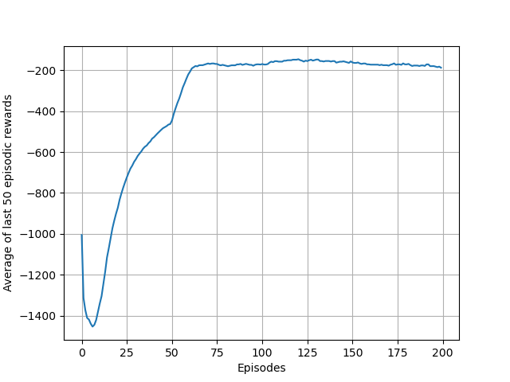

# RL Algorithms for Pendulum-v0 Environment
- DDPG Algorithm
- PPO algorithm
   - PPO-Clip Method
   - PPO with adaptive KL Penalty

The main codes are inside the  `./clean/` folder. Look into
the comments on the top of each source file for more details
about the implementation.

The above algorithms are developed using actor-critic model. 

### Training with DDPG Algorithm

### Training with PPO Algorithm

