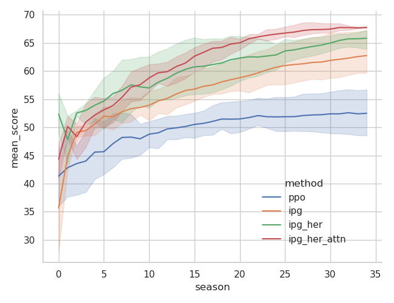
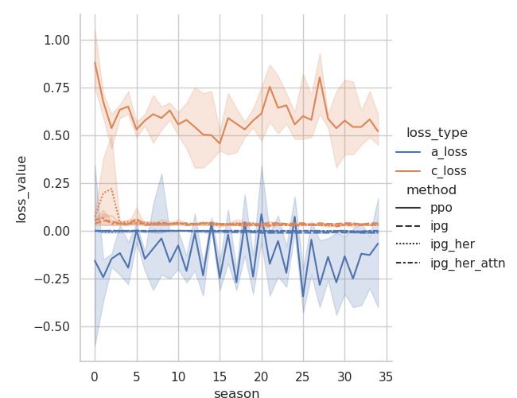
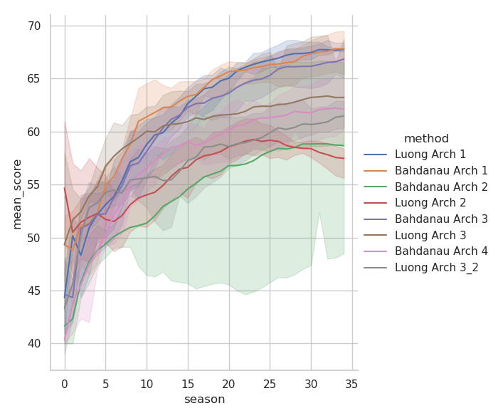

# Interpolated Policy Gradients

**Acknowledgement**: 

Originally contributed by [Mr. Hayden Sampson](URL: https://github.com/hayden750/DeepHEC)

## Algorithms implemented
- IPG 
- IPG + HER (Hindsight Experience Replay)

## Dependencies
- Python 3.x
- Tensorflow 2.x
- Tensorflow_probabilities
- Seaborn

## Files
- `./ipg.py`
- `./ipg_her.py`
- `../main.py`
- `../common/FeatureNet.py`
- `../common/utils.py`


## Execution

```
$ python ../main.py

```

## Results 

### Performance Comparison
The performance of the following methods are compared for the
  `KukaDiverseObject` pybullet-gym environment.

 - PPO
 - IPG
 - IPG + HER
 - IPG + HER + Attn




 
- Each Season includes 1024 training steps which is equivalent to 128
episodes.  
- The plots are generated using python's [seaborn](https://seaborn.pydata.org/introduction.html) module.
- The code is executed three times to gather data for statistical
plot.
 
### Effect of Attention
- Arch 1: Single attention layer in between two Conv layers
- Arch 2: x + Attention(x) between two Conv layers
- Arch 3: x * Attention(x) between two Conv layers
- Arch 4: Single attention layer after the last Conv layer
- Arch 3_2: \sigma(x * Attention(x))

The attention layers are implemented using [Keras
Attention](https://keras.io/api/layers/attention_layers/) APIs.
'Multi-headed attention' is found to be extremely slow
(computationally expensive) without much gain in performance.


