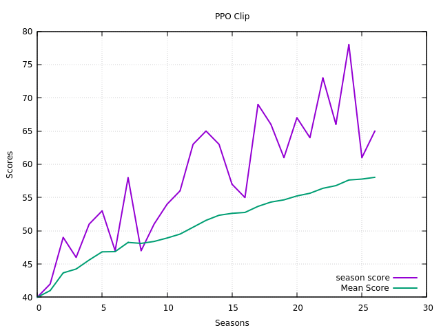
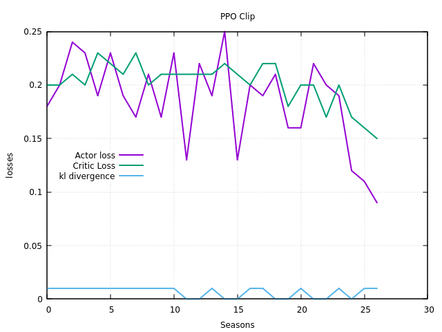
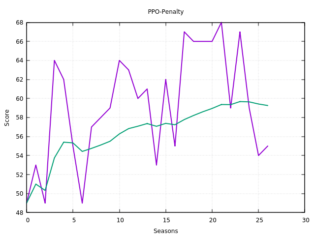
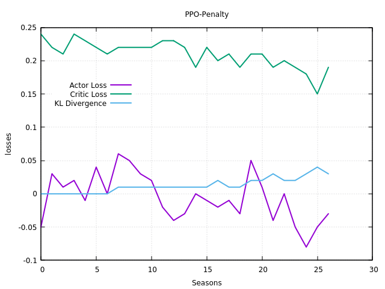

### PPO Algorithm for Kuka Diverse Object Environment
This code provides the PPO implementation for Kuka Diverse Object Environment
using an Actor-Critic model. It implements both 'clip' and 'KL penalty' variants
of the PPO method. PPO-Clip performs better compared to the 'penalty' method.

**Dependencies**:
- Tensorflow 2.2.0
- Tensorflow Probability >= 0.7.0
- Python 3.6
- PyBullet 3.0.6
- Conda 4.9.1

**References**:
- [Mahyaret's Github Page](https://github.com/mahyaret/kuka_rl/blob/master/kuka_rl_2.ipynb)
- [Abhishek Suran's blog](https://towardsdatascience.com/proximal-policy-optimization-ppo-with-tensorflow-2-x-89c9430ecc26)


Code Files:
- main_ppo.py
- ppo.py

Execute:
```
python3 main_ppo.py
````
### Network Architectures

- Feature Network: Convolutional Neural Network 
- Actor Network: Feature Net --> Fully Connected network
- Critic Network: Feature Net --> Fully Connected Network

### Results:

**Results with PPO 'clip' method**

- Rewards and Scores: Each season involves 1000 environment steps. The score for each season is the total reward
obtained during these 1000 steps. Mean score is the average of season scores over last 100 seasons. As you can see
  the score increases as training progresses. 



- Losses: (1) Actor Loss and (2) Critic Loss and (3) KL divergence between
the new and the old policy distribution.



**Results with PPO 'penalty' method**

- Updating beta slows down the learning process
- The following results are produced with fixed beta (= 0.5).

Rewards and Scores:



Losses:



