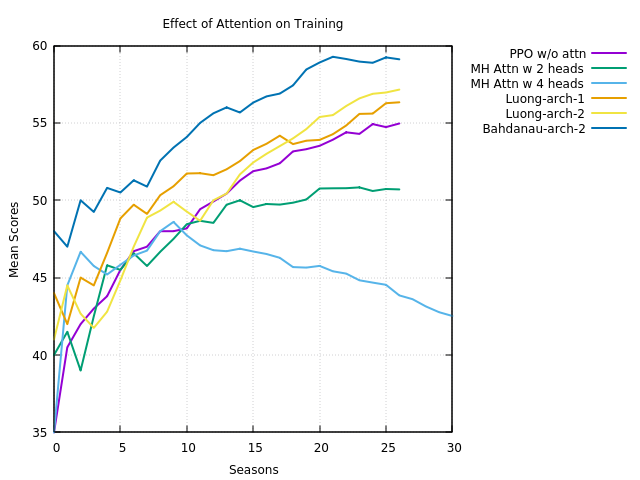

### PPO Algorithm for Kuka Diverse Object Environment
This code provides the PPO implementation for Kuka Diverse Object Environment
using an Actor-Critic model. It implements both 'clip' and 'KL penalty' variants
of the PPO method. PPO-Clip performs better compared to the 'penalty' method.

**Dependencies**:
- Tensorflow 2.2.0
- Tensorflow Probability >= 0.7.0
- Python 3.6
- PyBullet 3.0.6
- Conda 4.9.1

**References**:
- [Mahyaret's Github Page](https://github.com/mahyaret/kuka_rl/blob/master/kuka_rl_2.ipynb)
- [Abhishek Suran's blog](https://towardsdatascience.com/proximal-policy-optimization-ppo-with-tensorflow-2-x-89c9430ecc26)


Code Files:
- main_ppo.py
- ppo.py

Execute:
```
python3 main_ppo.py
````
### Network Architectures

- Feature Network: A Convolutional Neural Network shared by both Actor and critic networks
- Actor Network: (Image Input) --> Feature Net --> Fully Connected network --> (Action Output)
- Critic Network: (Image Input) --> Feature Net --> Fully Connected Network --> (Value Output)

### Results:

**Results with PPO 'clip' method**

- Rewards and Scores: Each season involves 1000 environment steps. The score for each season is the total reward
obtained during these 1000 steps. Mean score is the average of season scores over last 100 seasons. As you can see
  the score increases as training progresses. 


- Losses: (1) Actor Loss and (2) Critic Loss and (3) KL divergence between
the new and the old policy distribution.


**Results with PPO 'penalty' method**

- Updating beta slows down the learning process
- The following results are produced with fixed beta (= 0.5).

Rewards and Scores:


Losses:


 
---
### Applying attention to the feature network
The following Keras APIs for attention are applied to the feature
network. Please see the file `AttnFeatureNet.py` in the
`/kukacam/common` folder.
- Luong-style Attention: `keras.layers.Attention()`
- Bahdanau-style Attention:`keras.layers.AdditiveAttention()` 
- Multi-head Attention:`keras.layers.MultiHeadAttention()`

The first two provides better performance compared the last one which
is also computationally very expensive. The two architectures of
applying the attention layers are as follows:
- Architecture 1:
`Conv2D - Attention - Conv2D - Attention - Conv2D - Attention - Flatten - Dense layers`
- Architecture 2: Same as above but `x + Attention(x)` is applied to
the next layer


